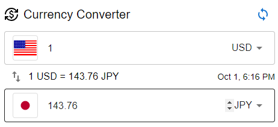

# react-currency-converter-widget

Currency Converter React widget for https://github.com/minnya/react-currency-converter-widget.git



# Install

`yarn add -D react-currency-converter-widget`

or

`npm install --save-dev react-currency-converter-widget`

# Usage

```typescript
import React from 'react';
import CurrencyConverter from 'react-currency-converter-widget';

render() {
    return (
        <div>
            <CurrencyConverter  />
        </div>
    );
}
```

# Props

### initialFromCurrency: [ string ]

Initial From Currency (ex: `USD`)

### initialToCurrency: [ string ]

Initial To Currency (ex: `JPY`)
